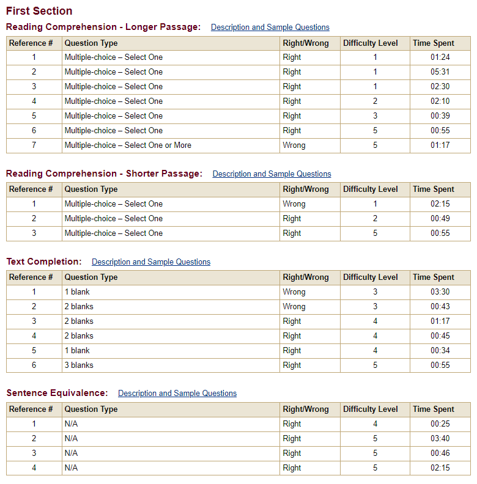
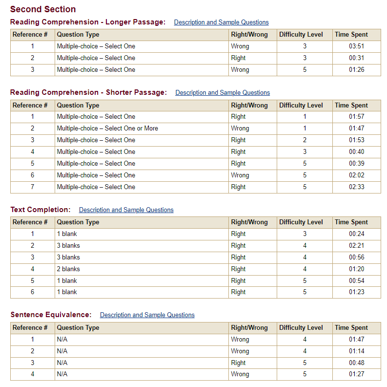

# GRE-All-In-One

> This repository includes all the GRE learning materials you will need.

本人在一个月的时间内完全通过自己准备取得了:V162+Q168+AW3.5的成绩，虽然跟很多大神没得比，但个人还是比较满意了。

接下来简单介绍一下个人备考心得：

## Vocabulary

GRE的单词是重中之重，可以说你如果单词背好了基本不会遇到什么问题。这里推荐使用琦叔的《[再要你命3000》](https://github.com/RainWang6188/GRE-All-In-One/blob/master/Vocabulary/要你命系列/GRE 词汇-陈琦《再要你命3000》.pdf)（i.e. 大3000），把这里的单词吃透GRE上330完全够了。很多人说要背新东方的《[GRE词汇精选](https://github.com/RainWang6188/GRE-All-In-One/blob/master/Vocabulary/GRE词汇精选（红宝书）.pdf)》（红宝书），个人也背过，感觉部分单词过于生僻，对于短期冲刺的同学来说性价比不是很高。

背单词的方法建议阅读杨鹏老师的《[17天搞定GRE单词](https://github.com/RainWang6188/GRE-All-In-One/blob/master/Vocabulary/17天搞定GRE单词杨鹏.pdf)》，这个方法论我个人尝试过很有用，但确实需要很强的毅力，始终牢记复习比背新词更有用。同学们可以使用这个[网页](https://exam4.us/)制定背单词计划表。

每天背单词的时候可以把记不住/重要的词汇用excel表记录一下，复习的时候对这些单词也就更需要重视。

考前一周除了复习之外也可以加强巩固一下《[GRE救命800词 ](https://github.com/RainWang6188/GRE-All-In-One/blob/master/Vocabulary/微臣考前单词/《GRE救命800词 》.pdf)》，里面的单词都是很重要的。

## Verbal

### Text Completion

GRE最难的部分就是Verbal的填空，这里除了背单词还需要一定量的刷题，不仅能保持做题手感，控制好考试时间，在考场上也能遇到原题，给你信心的同时也极大节约了时间。强烈建议使用线上平台做机经，这里推荐使用[考满分](https://gre.kmf.com/practise)，个人使用感觉效果很不错。每个section做完后可以mark一下有价值的错题，定时复习。

至于阅读方法论，小白可以看看b站里的皇冠GRE的[《GRE填空核心理论》](https://www.bilibili.com/video/BV1X5411E77u?from=search&seid=15862113654467010809&spm_id_from=333.337.0.0)，再配合一定数量的刷题，就能够真正感受到GRE的本质是考逻辑。

### Reading

前面提到单词是GRE的重点，那另一个重点就在于**长难句**，无论是填空还是阅读，真正阻碍你的就是那些成分、句式复杂，长度惊人的句子，把长难句拿下能让你的GRE成绩再上一个台阶。我很推荐阅读杨鹏老师的《[长难句](https://github.com/RainWang6188/GRE-All-In-One/blob/master/Verbal/Reading/长难句.pdf)》，一共100句，每天读20句，自己分析理解，效果很棒。虽然我自己TOEFL阅读29分，但一开始面对GRE阅读很吃力，短时间内无法读懂，正确率很低，后来把阅读长难句的能力提上来之后就好了很多。

GRE的阅读分为长阅读、中阅读和短阅读和逻辑单题四类，长阅读一次考试只会出现一次，其余就是大量的中/短阅读和每个section 1~2道的逻辑单题。阅读方法我自己是精读全文，然后不回看直接做题，这需要一定的训练。这里强烈推荐阅读一下这篇[文章](http://bbs.gter.net/forum.php?mod=viewthread&tid=1780746&highlight=%D1%EE%C5%F4)，绝对让你获益匪浅。

阅读的方法论可以参考《[解密GRE阅读逻辑线](https://github.com/RainWang6188/GRE-All-In-One/blob/master/Verbal/Reading/解密GRE阅读逻辑线.pdf)》，很多人推荐，但我因为时间关系没有细看。

## Quantitative

GRE的数学难度还是比较低的，如果基础不错我感觉考前刷一遍《[巍哥GRE数学170难题3.0](https://github.com/RainWang6188/GRE-All-In-One/blob/master/Quantitative/巍哥GRE数学170难题3.0.pdf)》，把错题弄弄就可以上考场了。如果过程中遇到某一部分的概念不清淅，就需要把那块重新复习一遍。考试的时候一定要细心，题目虽然难度不大但还是有陷阱的。

## AW

因为本人是工科，对作文就不是很重视，甚至考前都没写过练手，就读了几篇范文。（个人感觉只要把字数写够3.5分不是问题...）如果时间充分，或对作文分数有较高要求的建议对着题库准备，因为GRE的AW题库是固定的，只要你准备的足够充分，考场上一定能遇到原题。

如果时间充裕可以阅读一下李建林老师写的《[新GRE写作5.5](https://github.com/RainWang6188/GRE-All-In-One/blob/master/Analitical-Writing/新GRE写作5.5(最新修订版)%2B李建林.pdf)》

## 考试形式与时间分配

考场上会有两种情况：Verbal加试或Quantitative加试。个人感觉Q加试对中国学生来说会好一些，我自己考了两次，感觉Q加试时V的难度会相对低一些（也可能是偶然情况）。

GRE是难度自适应考试，所以第一个section的正确率尤为关键。如果你第一个section正确率很高，就能进入Hard模式，这样的情况下第二个section只要不要错的太离谱上160还是比较容易的（我自己Verbal第一个section错了4个，第二个section错了7个，也有162）

时间分配来说，Verbal一般是先把所有的填空花10-12分钟做完，剩下的时间去读阅读。填空相对于阅读还是更好拿分的，阅读你可能花了很长时间也不一定读的懂，读懂了也不一定做得对题目（x），所以建议填空在时间允许的条件下仔细斟酌。Quantitative的花正常来讲匀速做完一般会剩10分钟左右，如果是加试可能时间会来不及，不过也不必的担心，加试并不算分。

综上，备考GRE建议短期冲刺，拉长战线会很痛苦。单词一定要提前背，如果一点没背去做题是没有效果的。ETS官网还有两份模拟卷可以用来找找整套做题的手感。如果在备考过程中有任何问题欢迎email联系！

最后祝大家早日杀G！

